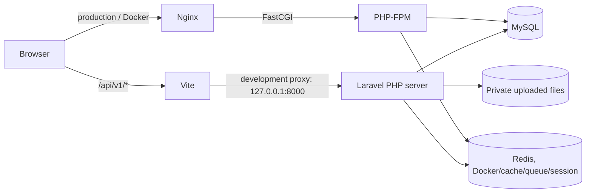

# SarkariLinks Backend Technical Guide

## 1. Purpose

SarkariLinks uses a React/TypeScript frontend and a Laravel 13 backend API. The backend provides:

- Public content, appearance, tools, terms, SEO, and readiness endpoints.
- Member registration, login, profiles, bookmarks, recommendations, resumes, and media downloads.
- Staff CMS, advertisement import, content workflow, roles, permissions, and audit APIs.
- Queue jobs for background work and scheduled tasks.

The frontend does not normally call Laravel directly by a hard-coded public hostname. It calls same-origin paths such as `/api/v1/content`; Vite proxies those paths to Laravel during development, and Nginx routes them to PHP-FPM in Docker.

## 2. Request flow



### Development

`npm.cmd run dev` starts four processes from `scripts/dev.mjs`:

1. Laravel's PHP development server on `127.0.0.1:8000`.
2. Laravel's scheduler worker.
3. Laravel's queue worker.
4. Vite on `127.0.0.1:5173`.

Vite proxies `/api`, `/sitemap.xml`, and `/robots.txt` to `PORTAL_API_TARGET`, or to `http://127.0.0.1:8000` when that variable is not set.

### Docker

Docker Compose runs:

- `nginx`: serves the built React files on `http://localhost:8080`.
- `php-fpm`: runs Laravel through FastCGI.
- `mysql`: MySQL 8.4 with a persistent `mysql-data` volume.
- `redis`: Redis 7.4 with a persistent `redis-data` volume.
- `queue-worker`: processes Laravel queue jobs.
- `scheduler`: runs Laravel scheduled tasks.

Nginx sends `/api/*`, `/up`, `/`, and frontend fallback requests to `/var/www/html/public/index.php` in PHP-FPM. Static assets are served directly.

## 3. Laravel route layout

Laravel registers routes in `backend/bootstrap/app.php`:

- `backend/routes/api.php`: public read-only API routes and `/api/v1/health/ready`.
- `backend/routes/web.php`: browser session, authentication, member, admin, SEO, and SPA fallback routes.
- `backend/routes/console.php`: Artisan commands and scheduled task definitions.

The API file is automatically mounted with Laravel's `api` prefix, so a route declared as `/v1/content` is available at `/api/v1/content`.

Browser session routes are intentionally in the web middleware group. This provides encrypted HttpOnly cookies, session rotation, and CSRF protection for writes. Admin routes additionally require authentication and permissions such as `cms.access`, `settings.manage`, or `users.manage`.

## 4. Current configuration

### Workstation configuration

The current file is `backend/.env`. It is ignored by Git and must not be committed.

| Variable | Current role | Expected local value |
|---|---|---|
| `APP_ENV` | Runtime environment | `local` |
| `APP_DEBUG` | Detailed error pages | `true` locally; `false` outside local development |
| `APP_KEY` | Encryption, cookies, signed values | Generated Laravel base64 key |
| `DB_CONNECTION` | Database driver | `mysql` |
| `DB_HOST` | Database host | `127.0.0.1` for a local MySQL server |
| `DB_PORT` | Database port | `3306` |
| `DB_DATABASE` | Application database | `sarkarilinks_co_live` |
| `DB_USERNAME` / `DB_PASSWORD` | Database credentials | Local MySQL account |
| `SESSION_DRIVER` | Session storage | `database` |
| `CACHE_STORE` | Cache/rate-limit storage | `database` |
| `QUEUE_CONNECTION` | Queue backend | `database` |
| `FILESYSTEM_DISK` | Uploaded file storage | `local` |
| `MAIL_MAILER` | Email delivery | `log` for local development |

Do not copy the password from `backend/.env` into documentation, screenshots, tickets, or source control. Because a credential has existed in a local environment file, rotate it if it has been shared outside the intended machine.

### Docker configuration

Docker does not use `backend/.env` automatically. `compose.yaml` reads variables from a root `.env` file:

```dotenv
APP_KEY=base64:...
APP_URL=http://localhost:8080
DB_DATABASE=sarkarilinks
DB_USERNAME=sarkarilinks
DB_PASSWORD=<strong application password>
DB_ROOT_PASSWORD=<strong root password>
```

Inside Compose, Laravel must use:

```dotenv
DB_CONNECTION=mysql
DB_HOST=mysql
DB_PORT=3306
CACHE_STORE=redis
QUEUE_CONNECTION=redis
SESSION_DRIVER=redis
REDIS_HOST=redis
```

The hostnames `mysql` and `redis` are Docker service names. They are not valid replacements for `127.0.0.1` in a normal workstation process.

## 5. Database and migrations

Migrations are in `backend/database/migrations`. They create users, cache/jobs tables, content, access control, advertisements, tools, member workspace, appearance, and site information.

Migrations are deliberately not run automatically during web startup. After a new Docker database is healthy, run:

```powershell
docker compose up -d mysql redis
docker compose run --rm php-fpm php artisan migrate --force
docker compose up -d
```

For a workstation MySQL database:

```powershell
cd backend
php artisan migrate
php artisan db:seed
```

The local database must contain the `cache` and `jobs` tables because the current workstation configuration uses database cache, database sessions, and database queues. If MySQL is unavailable, Laravel may fail before a controller runs because throttling and session/cache middleware need storage.

## 6. Starting and checking the backend

### Normal workstation start

From the repository root:

```powershell
npm.cmd run dev
```

Open:

- Frontend: `http://127.0.0.1:5173`
- Admin frontend: `http://127.0.0.1:5173/admin`
- Laravel directly: `http://127.0.0.1:8000`

### Useful checks

```powershell
cd backend
php artisan about
php artisan route:list --path=api/v1
php artisan migrate:status
php artisan config:clear
php artisan test
```

Readiness check:

```powershell
Invoke-WebRequest http://127.0.0.1:8000/api/v1/health/ready
```

A healthy response is HTTP 200 with:

```json
{"status":"ready"}
```

A 503 response means Laravel loaded but could not execute `SELECT 1` against the configured database. A 500 response before that usually indicates a configuration, cache/session, or application boot problem.

## 7. Security configuration

The Docker Nginx configuration currently enables:

- `X-Content-Type-Options: nosniff`
- `Referrer-Policy: strict-origin-when-cross-origin`
- `X-Frame-Options: DENY`
- A restrictive Content Security Policy
- Hidden-file denial and disabled Nginx server tokens
- A 12 MB request limit

Laravel protects browser writes with CSRF middleware and uses permission middleware for staff operations. Uploaded originals are stored privately and downloaded through authorized Laravel endpoints.

## 8. Potential issues and risks

### High priority

1. **Environment split can cause startup failure.** Docker requires root `.env`, while workstation Laravel reads `backend/.env`. Creating or editing only one file does not configure the other runtime.
2. **Database driver and host must match the runtime.** Workstation mode uses MySQL at `127.0.0.1`; Docker uses MySQL at `mysql`. A stale `DB_CONNECTION=sqlite` or a MySQL database name under SQLite causes errors such as “database file does not exist.”
3. **Secrets must be rotated if exposed.** Database passwords and `APP_KEY` are operational secrets. Never commit `.env`; rotate credentials that leave the machine or appear in logs.
4. **`APP_DEBUG=true` is local-only.** Debug pages can expose paths, configuration details, and stack traces. Use `APP_DEBUG=false` in staging and production.

### Medium priority

5. **Docker is not available on every workstation.** If Docker Desktop is absent or not on `PATH`, Compose cannot be checked or started. Use the PHP/MySQL/Redis workstation setup or install Docker Desktop.
6. **Workers are required for background features.** Advertisement extraction and media downloads may remain queued if `queue-worker` or the local queue process is not running.
7. **Scheduler is required for scheduled work.** Expiry, recovery, or other scheduled operations will not run without the scheduler process.
8. **Cached configuration can hide fixes.** After changing `.env`, run `php artisan config:clear`. Production deployments should rebuild configuration cache deliberately.
9. **Port conflicts can produce misleading results.** Existing PHP processes on port 8000 or Vite processes on port 5173 can make a request hit the wrong application or fail to start.
10. **Database persistence can hide schema changes.** Docker volumes survive container recreation. Run migrations explicitly and inspect `php artisan migrate:status` after code changes.

### Lower priority

11. **Local mail is log-only.** `MAIL_MAILER=log` does not send real email.
12. **Local media tools are external dependencies.** OCR, PDF extraction, Python, and FFmpeg paths must exist for those features; the web API can still start without a successful media job.
13. **Public content may be empty after a fresh install.** Seed roles and create a staff account before testing editorial workflows.

## 9. Recommended troubleshooting order

1. Confirm which runtime is being used: workstation PHP or Docker.
2. Check the correct environment file for that runtime.
3. Confirm `APP_KEY` is non-empty and clear cached config.
4. Confirm MySQL is running, credentials are valid, and the database name exists.
5. Run `php artisan migrate:status`.
6. Call `/api/v1/health/ready`.
7. Check `backend/storage/logs/laravel.log` or Docker logs.
8. Confirm queue and scheduler processes for background or scheduled features.
9. Only then investigate frontend requests and browser errors.

## 10. Verification baseline

The backend baseline should include:

```powershell
cd backend
composer validate --strict
php artisan test
vendor/bin/pint --test
```

The frontend baseline should include:

```powershell
npm --prefix frontend run build
```

A backend change is not considered verified until the readiness endpoint and the relevant Laravel tests pass.
