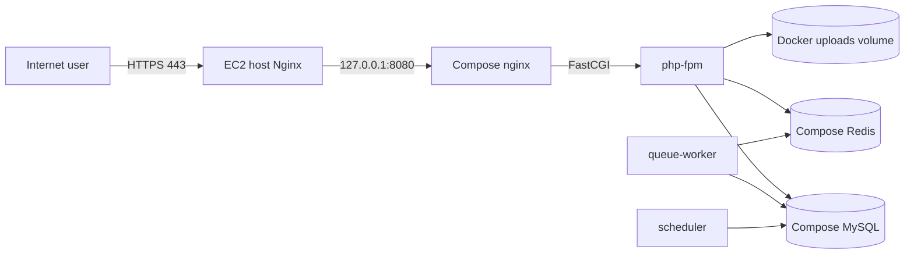

# SarkariLinks EC2 Deployment Guide

This guide deploys the existing Docker Compose application to one AWS EC2 instance. It is intended for a small production or staging installation and uses:

- Ubuntu 24.04 LTS EC2 instance
- Docker Engine and Docker Compose Plugin
- The repository's `compose.yaml`
- Host Nginx as the public reverse proxy
- Let's Encrypt TLS with Certbot
- MySQL and Redis containers on private Docker networking
- Persistent Docker volumes for database, Redis, and private uploads

This is a single-server deployment. It does not provide automatic failover, multi-AZ availability, managed database backups, or zero-downtime releases.

## 1. Architecture



The repository's container Nginx listens on port 8080 and is published only on the EC2 loopback interface:

```yaml
ports: ["127.0.0.1:8080:8080"]
```

This is desirable because MySQL, Redis, and the application's internal port are not exposed to the internet. The EC2 host Nginx owns ports 80 and 443 and forwards traffic to `http://127.0.0.1:8080`.

## 2. AWS prerequisites

### Recommended starting size

For a low-traffic deployment with advertisement extraction and media jobs, start with at least:

- 2 vCPU
- 4 GB RAM
- 40 GB gp3 EBS storage
- Ubuntu 24.04 LTS

The Docker build includes Node, PHP, Python, FFmpeg, frontend assets, and media dependencies. More RAM may be needed while building or processing large media jobs.

### Security group

Allow only:

| Port | Source | Purpose |
|---:|---|---|
| 22 | Your fixed office/VPN IP only | SSH administration |
| 80 | `0.0.0.0/0` and `::/0` | HTTP and Let's Encrypt challenge |
| 443 | `0.0.0.0/0` and `::/0` | HTTPS |

Do not expose ports 3306, 6379, 8000, or 8080. They are not required by clients. If an ALB or CloudFront is used later, restrict inbound traffic accordingly.

Attach an Elastic IP or use a stable load balancer address. Point the DNS `A` record for the site to that address before requesting a certificate.

## 3. Prepare the EC2 instance

Connect using the EC2 key pair:

```bash
ssh -i /path/to/key.pem ubuntu@YOUR_EC2_PUBLIC_IP
```

Update Ubuntu and install basic tools:

```bash
sudo apt update
sudo apt upgrade -y
sudo apt install -y git curl ca-certificates nginx certbot python3-certbot-nginx unzip
```

Install Docker from Docker's official repository:

```bash
sudo install -m 0755 -d /etc/apt/keyrings
sudo curl -fsSL https://download.docker.com/linux/ubuntu/gpg -o /etc/apt/keyrings/docker.asc
sudo chmod a+r /etc/apt/keyrings/docker.asc
printf '%s\n' \
  'Types: deb' \
  'URIs: https://download.docker.com/linux/ubuntu' \
  "Suites: $(. /etc/os-release && echo "$VERSION_CODENAME")" \
  'Components: stable' \
  'Architectures: amd64' \
  'Signed-By: /etc/apt/keyrings/docker.asc' | \
  sudo tee /etc/apt/sources.list.d/docker.sources > /dev/null
sudo apt update
sudo apt install -y docker-ce docker-ce-cli containerd.io docker-buildx-plugin docker-compose-plugin
sudo usermod -aG docker "$USER"
```

Log out and back in so the Docker group membership applies. Verify:

```bash
docker --version
docker compose version
sudo systemctl enable --now docker
```

## 4. Clone the application

Create an application directory:

```bash
sudo mkdir -p /opt/sarkarilinks
sudo chown -R "$USER":"$USER" /opt/sarkarilinks
cd /opt/sarkarilinks
git clone YOUR_PRIVATE_REPOSITORY_URL app
cd app
```

For a private Git repository, use a deploy key or a short-lived Git credential. Do not put a GitHub token in a shell history or committed file.

Choose the exact commit or release to deploy:

```bash
git checkout YOUR_RELEASE_TAG_OR_COMMIT
```

## 5. Create production secrets

Create the root `.env` file. This file is ignored by Git and is read by `compose.yaml`.

```bash
cd /opt/sarkarilinks/app
umask 077
cat > .env <<'EOF'
APP_KEY=REPLACE_WITH_A_RANDOM_LARAVEL_KEY
APP_URL=https://www.example.com
DB_DATABASE=sarkarilinks
DB_USERNAME=sarkarilinks
DB_PASSWORD=REPLACE_WITH_A_LONG_RANDOM_PASSWORD
DB_ROOT_PASSWORD=REPLACE_WITH_A_DIFFERENT_LONG_RANDOM_PASSWORD
EOF
```

Generate an application key without using a host PHP installation:

```bash
docker run --rm php:8.4-cli php -r 'echo "base64:".base64_encode(random_bytes(32)).PHP_EOL;'
```

Generate database passwords with a password manager or a local secure generator. Replace the placeholders in `.env` and verify the file permissions:

```bash
chmod 600 .env
```

Do not copy `backend/.env` to the server for the Docker deployment. Compose supplies the container environment from the root `.env`. The Docker values must use service names such as `DB_HOST=mysql` and `REDIS_HOST=redis`; those values are already defined in `compose.yaml`.

## 6. Build and initialize the database

Build the images:

```bash
docker compose build
```

Start only the database dependencies first:

```bash
docker compose up -d mysql redis
```

Wait until both dependencies are healthy:

```bash
docker compose ps
```

Run migrations explicitly:

```bash
docker compose run --rm php-fpm php artisan migrate --force
```

Seed default roles and permissions if this is a new installation:

```bash
docker compose run --rm php-fpm php artisan db:seed --force
```

Create the first administrator. Use the project command and a real administrator email:

```bash
docker compose run --rm php-fpm php artisan portal:create-staff admin@example.com --role=administrator
```

The command may ask for account details. Do not put the resulting password in this document or in shell history.

## 7. Start the application

Start all services:

```bash
docker compose up -d
```

Check the service state:

```bash
docker compose ps
docker compose logs --tail=100 nginx php-fpm queue-worker scheduler
```

Check the internal HTTP endpoint from the EC2 host:

```bash
curl -i http://127.0.0.1:8080/api/v1/health/ready
```

Expected response:

```json
{"status":"ready"}
```

The readiness endpoint performs `SELECT 1` against the configured MySQL connection. It does not prove that every queue, media tool, or admin workflow is healthy.

## 8. Configure host Nginx

Create a host-level site configuration. Replace the domain with the real DNS name:

```bash
sudo tee /etc/nginx/sites-available/sarkarilinks <<'EOF'
server {
    listen 80;
    listen [::]:80;
    server_name example.com www.example.com;

    client_max_body_size 12m;

    location / {
        proxy_pass http://127.0.0.1:8080;
        proxy_http_version 1.1;
        proxy_set_header Host $host;
        proxy_set_header X-Real-IP $remote_addr;
        proxy_set_header X-Forwarded-For $proxy_add_x_forwarded_for;
        proxy_set_header X-Forwarded-Proto $scheme;
        proxy_read_timeout 300s;
    }
}
EOF
sudo ln -s /etc/nginx/sites-available/sarkarilinks /etc/nginx/sites-enabled/sarkarilinks
sudo rm -f /etc/nginx/sites-enabled/default
sudo nginx -t
sudo systemctl reload nginx
```

Confirm the DNS record resolves to the EC2 public address before requesting TLS:

```bash
dig +short example.com
curl -I http://example.com
```

## 9. Enable HTTPS

Request a certificate:

```bash
sudo certbot --nginx -d example.com -d www.example.com
```

Choose the redirect option when prompted so HTTP redirects to HTTPS. Verify renewal:

```bash
sudo certbot renew --dry-run
```

After TLS is active, change `APP_URL` in the root `.env` to the canonical HTTPS URL and recreate the application containers:

```bash
docker compose up -d --force-recreate php-fpm queue-worker scheduler
```

## 10. Production settings checklist

Before public launch:

- Set `APP_ENV=production` and keep `APP_DEBUG=false` in the Compose environment.
- Use a unique `APP_KEY` and strong unique MySQL passwords.
- Set `APP_URL` to the final HTTPS URL.
- Do not expose Docker ports for MySQL, Redis, PHP-FPM, or the internal Nginx.
- Confirm the security group allows SSH only from trusted IPs.
- Confirm `docker compose ps` shows healthy MySQL and Redis.
- Confirm queue-worker and scheduler are running.
- Run `php artisan migrate:status` through the `php-fpm` container.
- Test login, CSRF-protected writes, public content, private downloads, and an advertisement import.
- Configure CloudWatch, disk alerts, and an external uptime check.
- Configure an off-instance database backup before storing important data.

The current `compose.yaml` hard-codes `APP_ENV: local` in its application environment. For production, change that Compose value to `production` or create a production override file before deployment. Do not rely on `backend/.env` to override the Compose environment.

## 11. Backups

Docker volumes are persistent but are not backups. Back up MySQL and private uploads to S3 or another off-instance location.

Create a database dump:

```bash
mkdir -p /opt/backups/sarkarilinks
chmod 700 /opt/backups/sarkarilinks
docker compose exec -T mysql mysqldump \
  -u"$(grep '^DB_USERNAME=' .env | cut -d= -f2-)" \
  -p"$(grep '^DB_PASSWORD=' .env | cut -d= -f2-)" \
  "$(grep '^DB_DATABASE=' .env | cut -d= -f2-)" \
  | gzip > /opt/backups/sarkarilinks/db-$(date +%Y%m%d-%H%M%S).sql.gz
```

Avoid placing passwords directly in process arguments for a long-term backup script because other users may see them through process inspection. For scheduled backups, use a protected MySQL client option file or, preferably, Amazon RDS automated backups and snapshots.

The private uploads volume is named `sarkarilinks_uploads` by Compose. A production backup process must copy it to external storage. A simple maintenance archive is:

```bash
docker run --rm \
  -v sarkarilinks_uploads:/source:ro \
  -v /opt/backups/sarkarilinks:/backup \
  alpine tar czf /backup/uploads-$(date +%Y%m%d-%H%M%S).tar.gz -C /source .
```

Keep backups encrypted, limit access, and periodically perform a restore test.

## 12. Deploying a new release

The safe order is:

```bash
cd /opt/sarkarilinks/app
git fetch --tags
git checkout YOUR_NEW_RELEASE_TAG

docker compose build
docker compose up -d mysql redis
docker compose run --rm php-fpm php artisan migrate --force
docker compose up -d

docker compose ps
curl -fsS https://example.com/api/v1/health/ready
```

Run the smoke tests before announcing the release:

- Homepage loads over HTTPS.
- `/api/v1/health/ready` returns `{"status":"ready"}`.
- Public content loads.
- Login and CSRF-protected actions work.
- Admin authorization still matches the expected role.
- Queue jobs complete.
- Scheduler logs show no repeated failures.

Because the Compose deployment uses persistent volumes and `opcache.validate_timestamps=0`, recreating the PHP container is important after a code release. `docker compose up -d` recreates containers whose image changed.

## 13. Rollback

If the new release is unhealthy:

```bash
cd /opt/sarkarilinks/app
git checkout PREVIOUS_RELEASE_TAG
docker compose build
docker compose up -d
curl -fsS https://example.com/api/v1/health/ready
```

Do not automatically roll back database migrations. First determine whether the migration is backward-compatible. Restore the database only after taking a current backup and understanding the data-loss impact.

## 14. Logs and troubleshooting

Application and worker logs:

```bash
docker compose logs -f php-fpm queue-worker scheduler
```

Nginx logs:

```bash
sudo journalctl -u nginx -f
docker compose logs -f nginx
```

Container status and health:

```bash
docker compose ps
docker inspect sarkarilinks-mysql-1 --format '{{json .State.Health}}'
docker inspect sarkarilinks-redis-1 --format '{{json .State.Health}}'
```

Common failures:

| Symptom | Likely cause | Check |
|---|---|---|
| `APP_KEY` error | Root `.env` missing or key empty | `grep '^APP_KEY=' .env` |
| MySQL connection refused | MySQL is not healthy or credentials differ | `docker compose ps`, MySQL logs |
| 502 from host Nginx | Compose Nginx is stopped or port changed | `curl http://127.0.0.1:8080`, `docker compose ps` |
| 413 upload error | Host or container body limit too small | Both Nginx configs use 12 MB |
| Jobs stay queued | Worker stopped or Redis unavailable | `docker compose logs queue-worker redis` |
| Scheduled actions do not run | Scheduler stopped | `docker compose logs scheduler` |
| Old PHP behavior after deploy | Container or OPcache not recreated | `docker compose up -d --force-recreate php-fpm` |
| HTTPS certificate fails | DNS or port 80 security group issue | `dig`, security group, Nginx config |

## 15. Operational limitations

This deployment has important limits:

1. One EC2 instance is a single point of failure.
2. MySQL and Redis are local containers, so instance loss affects availability and may affect data unless backups are current.
3. Docker volumes do not replace off-instance backups.
4. There is no built-in deployment lock or zero-downtime process.
5. `APP_ENV` is currently set to `local` in `compose.yaml` and should be changed for production.
6. Email uses the log mailer unless a real mail transport is added.
7. Media extraction requires adequate CPU, RAM, disk, Python dependencies, and FFmpeg.
8. Secrets are supplied through a server `.env`; AWS Secrets Manager or SSM Parameter Store is preferable for a larger or regulated deployment.

For a higher-availability system, move MySQL to Amazon RDS, Redis to ElastiCache, uploads to S3, images to ECR, and run the application on ECS/Fargate behind an Application Load Balancer.
