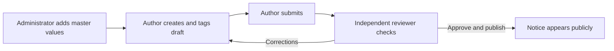

# Simple staff workflow

Current release: 6 September 2026. Open http://127.0.0.1:5173/login for staff access.

## 1. Administrator adds master values

**Admin → Taxonomy → choose type and language → enter Label and Slug → Save filter.**

| Type | Example label | Example slug |
| --- | --- | --- |
| state | Rajasthan | rajasthan |
| qualification | Graduate | graduate |
| department | Education | education |
| category | Teaching | teaching |

These are examples, not preloaded records. The current database contains no taxonomy values. Only the Administrator currently has `taxonomy.manage`. Another staff role needs both `cms.access` and `taxonomy.manage` to perform this step.

## 2. Author creates a notice

**Admin → Content → New draft → complete fields → choose master tags → Save draft → submit.**

For a PDF/image: **Advertisement imports → choose file and official source URL → Upload & extract → review/correct fields and category → select master tags → confirm source comparison → Create draft in selected section**. Then submit it from Content.

## 3. Independent reviewer publishes

**Content → open submitted notice → check official source and details → approve → publish**, or **schedule** a future publication time. Use **return** with a reason when corrections are needed.

The author and approver must be different people, including when an administrator authored the notice.

## 4. Visitor finds the notice

**Homepage/category/search → filter by state, qualification, department or category → open notice → check official source.** Members can save jobs and set matching preferences.

Adding a taxonomy value makes a filter available; it does not automatically tag or publish existing notices. A taxonomy `category` is a filter such as Teaching, not a new content section such as Jobs or Admissions.

More detail: [administrator manual](admin-user-manual.md) · [release notes](release-notes-2026-09-06.md).
